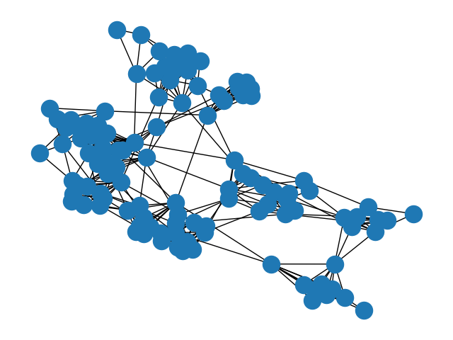
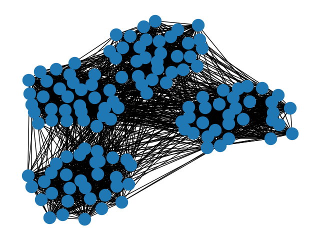

## Project Summary

For this project we were tasked with implementing our own version of the Girvan Newman algorithm using the boost library to detect communities in a given network. The Girvan Newman algorithm determines communities by calculating edge betweenness for every edge in the graph. Edge betweenness is defined as the number of the shortest paths that go through an edge in a graph or network. The edge with the highest edge betweenness value is then removed from the graph and edge betweenness is recalculated for all other edges in the graph. This process is repeated until defined communities have been formed.  We were given a dataset where college football teams represented vertices and the games played between the colleges were represented as edges. We ran our algorithm with this dataset to determine which conferences teams belonged to. We also tested our algorithm with randomly generated graphs.

## Building and Execution
This is an example of how to run our program through an ubuntu terminal. It takes one graphml file as an input via a command line argument.
```
cd /mnt/c/[path to project directory]
mkdir build
cd build
cmake ..
cmake --build .
./21f_pa03_kyle_ariyan [football.graphml or input.graphml] 
```
## Edge betweenness calculation
In our implementation of the algorithm, we calculate an edge betweenness value for every edge in the graph by determining the shortest paths from a source vertex to all other vertices in the graph using the boost library implementation of Dijkstra's algorithm. We then add one to the edge betweenness value of edges that appeared in the shortest paths. We repeat this process taking every vertex in the graph as a source vertex.

## Generating output
Our program generates a new graphml file after removing several edges from the graph. We used the python code below to generate images of the outputted graphml file from our program. 
```python 
from matplotlib import pyplot as plt
import networkx as nx
g = nx.read_graphml('/Users/kyledoran/Documents/graphOutput.graphml')
nx.draw(g)
plt.savefig("testOutput.png")
```
## Sample Output
Football dataset:



Randomly generated dataset:


